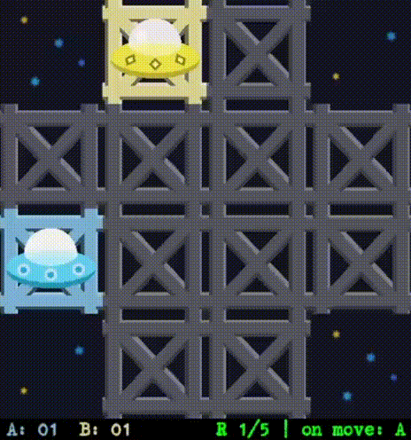
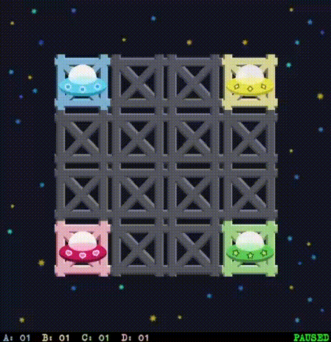

# AI Spaceship Arena 2

A competitive multi-agent game where AI-controlled spaceships compete to claim territory on a grid-based map. This project demonstrates various AI algorithms including adversarial search techniques.

## Game Description

AI Spaceship Arena is a turn-based strategy game where multiple spaceships (agents) compete to dominate the playing field. Each agent uses different AI algorithms to make strategic decisions about movement and territory control.

## Gameplay
<div align="center">
</img>
</div>

## Features
- **Multiple AI Agents**: Random, Greedy, MaxN, Minimax, and MinimaxAB (Alpha-Beta Pruning) algorithms
- **Customizable Maps**: Support for custom map files
- **Visual Interface**: Pygame-based graphical display
- **Configurable Game Settings**: Adjustable rounds, time limits, and search depth
- **Detailed Logging**: Game state and decision logging

## Prerequisites

- Python 3.7+
- Pygame library

## Usage

Run the game with the following command:

```bash
python main.py [agents] [map_file] [max_rounds] [max_time] [max_depth] [debug]
```

### Parameters

- `agents` - Comma-separated list of agent types (e.g., `RandomAgent,GreedyAgent,MaxNAgent,MinimaxAgent,MinimaxABAgent`)
- `map_file` - Map file name from the `maps/` folder (default: `example_map.txt`)
- `max_rounds` - Maximum number of game rounds (default: `5`)
- `max_time` - Maximum elapsed time in seconds (default: `0` - unlimited)
- `max_depth` - Maximum search depth for AI algorithms (default: `5`)
- `debug` - Debug mode (default: `True`)

### Examples

```bash
# Run with default settings (RandomAgent)
python main.py

# Two agents competing: Random vs Greedy
python main.py RandomAgent,GreedyAgent

# Three agents with custom map and 10 rounds
python main.py RandomAgent,GreedyAgent,MaxNAgent custom_map.txt 10

# Full configuration example
python main.py RandomAgent,GreedyAgent example_map.txt 5 60 5 True
```

## AI Agents

### RandomAgent
Makes random valid moves without any strategic planning. Useful as a baseline for comparison.

### GreedyAgent
Selects moves that immediately maximize the agent's score without considering future consequences. Uses a one-step lookahead approach.

### MaxNAgent
Uses the MaxN adversarial search algorithm to evaluate moves considering all players' strategies up to a specified depth. Suitable for multi-player games where each player tries to maximize their own score.

### MinimaxAgent
Implements the classic Minimax algorithm for two-player zero-sum games. Assumes the opponent will play optimally to minimize the agent's score while the agent tries to maximize it. Explores the game tree up to the specified depth.

### MinimaxABAgent (Minimax with Alpha-Beta Pruning)
An optimized version of Minimax that uses alpha-beta pruning to eliminate branches that don't need to be explored. Significantly improves performance while guaranteeing the same result as standard Minimax. Ideal for deeper search depths.


## Screenshots

### Multi-Agent Competition
<div align="center">
</img>
</div>

### Large Map Competition
<div align="center">
</img>
</div>

## Map Format

Maps are text files where:
- `.` - Free tile (navigable space)
- `#` - Abyss tile (obstacle)
- Letters (A-Z) - Starting positions for spaceships

## Logging

Game logs are automatically saved in the `logs/` folder with timestamps. Each log contains detailed information about game states, agent decisions, and scores.

## Configuration

Edit `config.py` to customize:
- Screen dimensions
- Tile sizes
- Maximum players
- Game speeds
- Colors and visual settings
